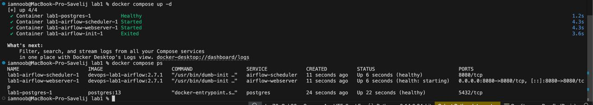
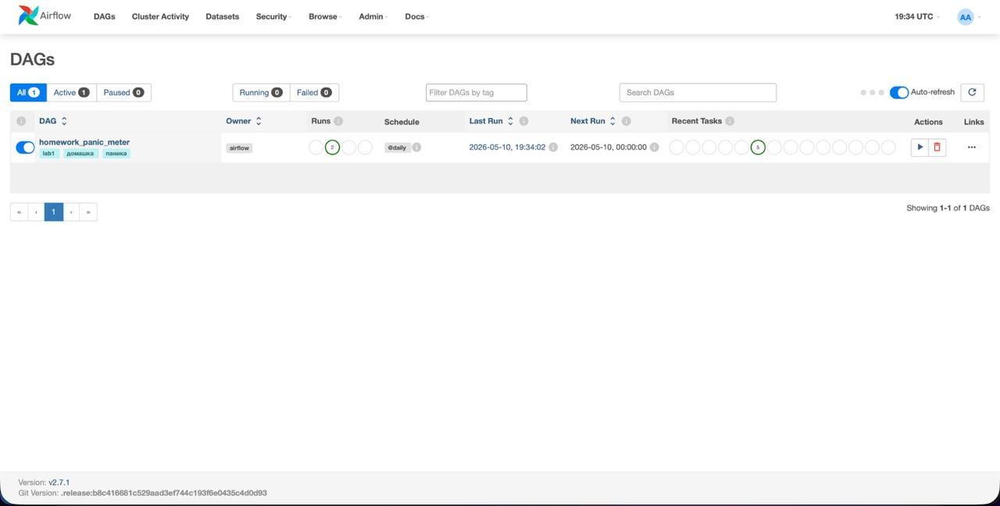

# Labs №1

## Что делает скрипт?

1. загружает список домашних заданий
2. считает общее количество часов
3. выбирает статус: спокойно, легкая паника или полная паника
4. пишет отчет в `output/homework_panic_<date>.md`
5. проверяет, что отчет был создан

## Как запустить

```bash
docker compose build
docker compose up airflow-init
docker compose up -d
docker compose ps
```

В UI можно попасть по ссылку [http://localhost:8080](http://localhost:8080).

Логин+пароль:

```text
airflow / airflow
```

## Док-ва что все воркает



