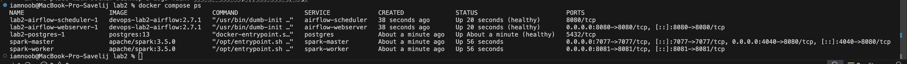
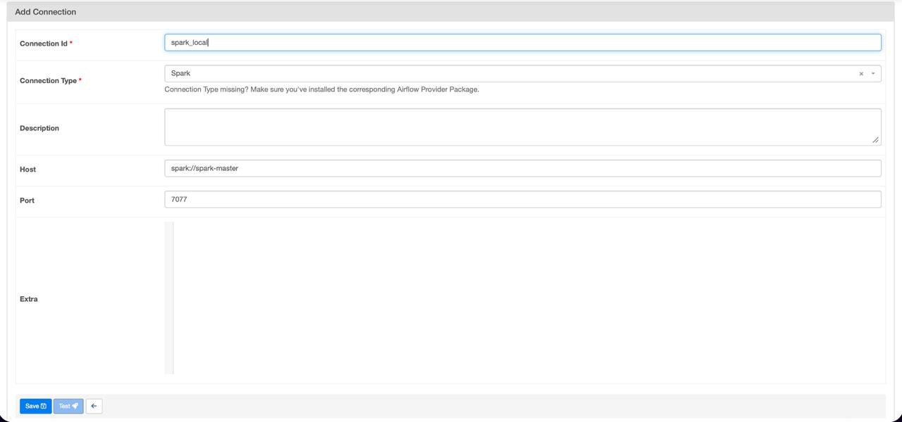
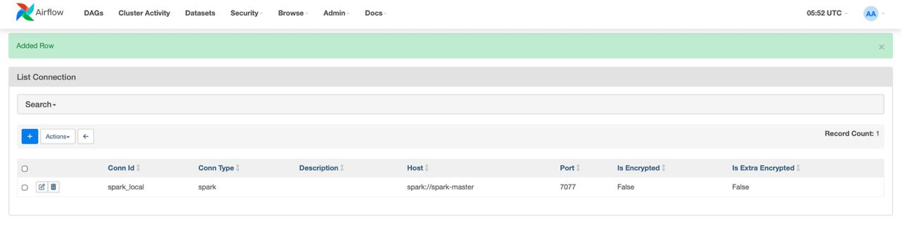
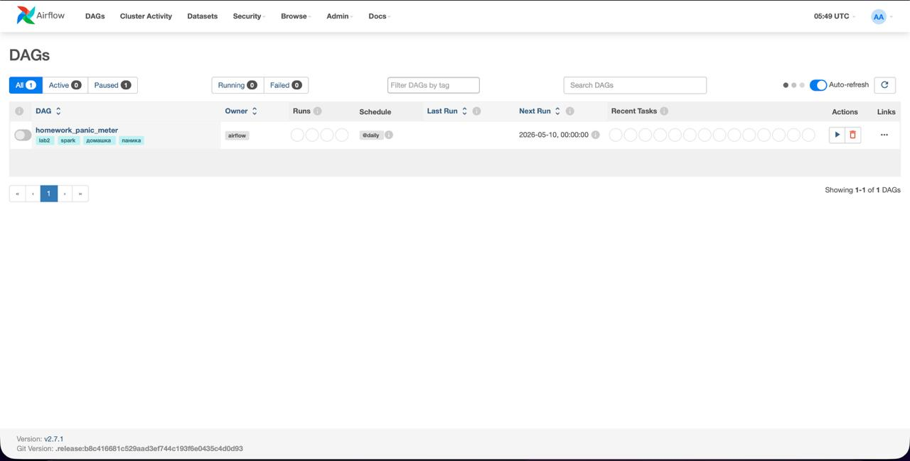
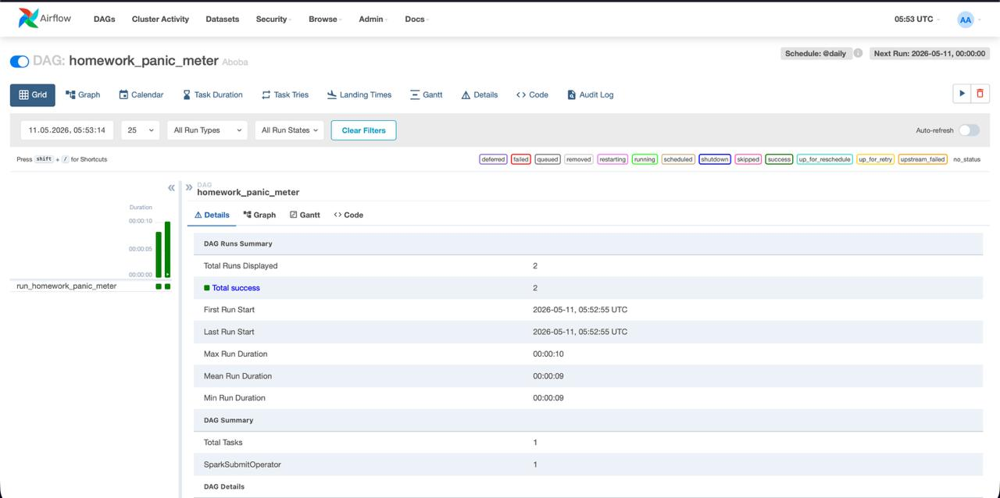
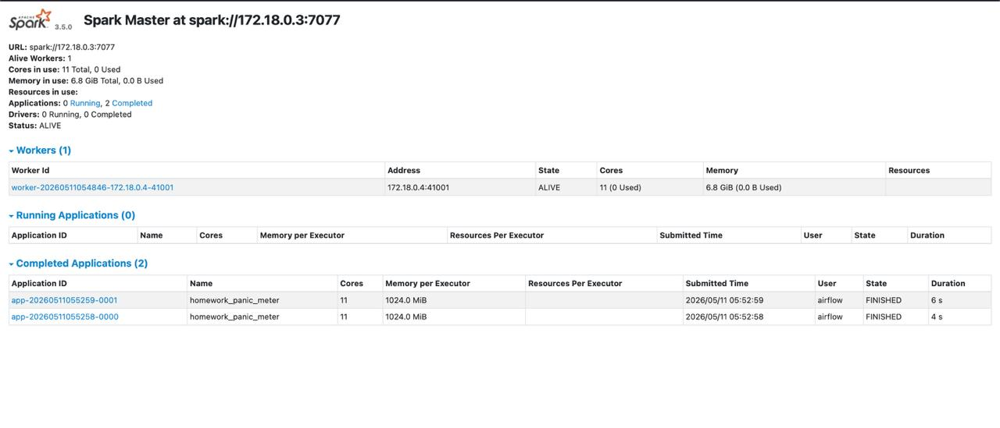

# Labs №2

## Что делает скрипт?

1. загружает список домашних заданий
2. считает общее количество часов
3. выбирает статус: спокойно, легкая паника или полная паника
4. пишет отчет в `output/homework_panic_<date>.md`
5. проверяет, что отчет был создан

## Spark джоба

1. создает `SparkSession`
2. загружает список домашних заданий в Spark DataFrame
3. считает общее количество часов через `pyspark`
4. выбирает статус паники
5. пишет отчет в `output/homework_panic_<date>.md`

## Как запустить

```bash
docker compose build
docker compose up airflow-init
docker compose up -d
docker compose ps
```

В UI можно попасть по ссылку [http://localhost:8080](http://localhost:8080).

Логин+пароль:

```text
airflow / airflow
```

В Spark UI можно попасть так [http://localhost:4040](http://localhost:4040)

Параметры подключения:

- имя: `spark_local`
- тип: `Spark`
- хост: `spark://spark-master`
- порт: `7077`

## Пруфы что все воркает












