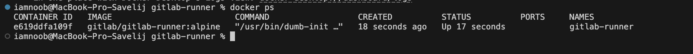
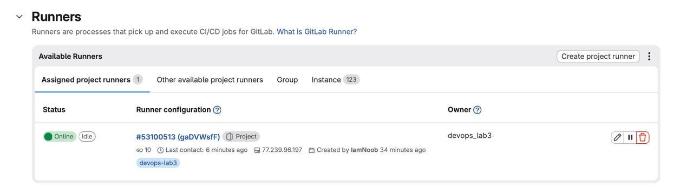
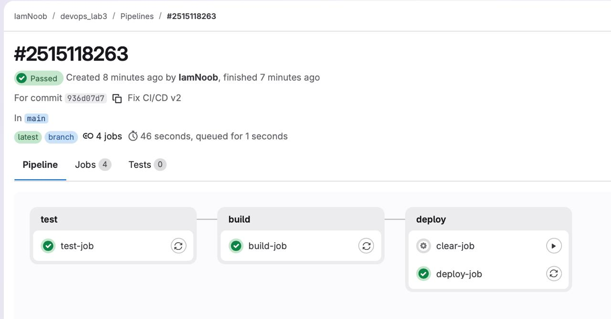
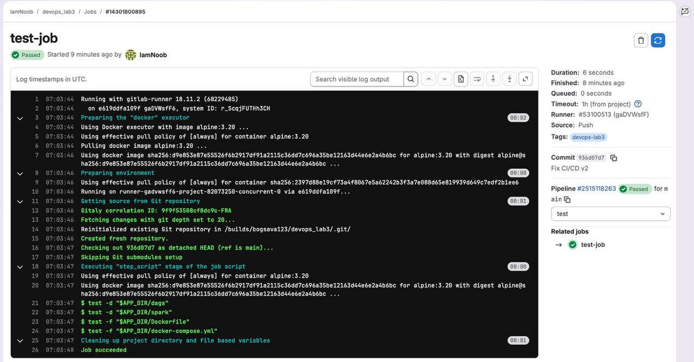
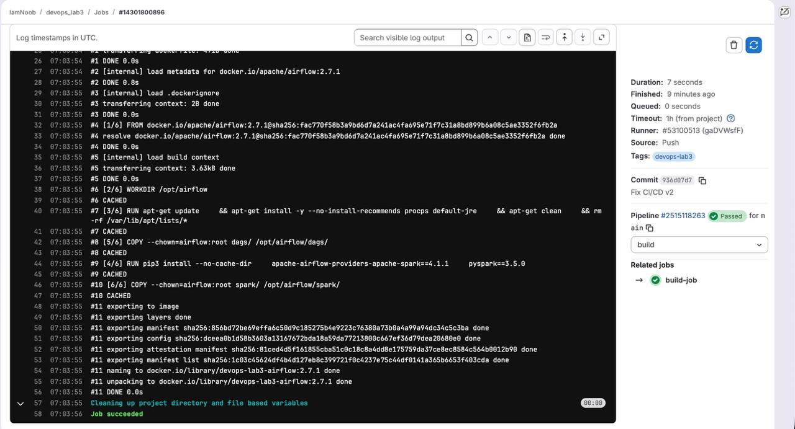
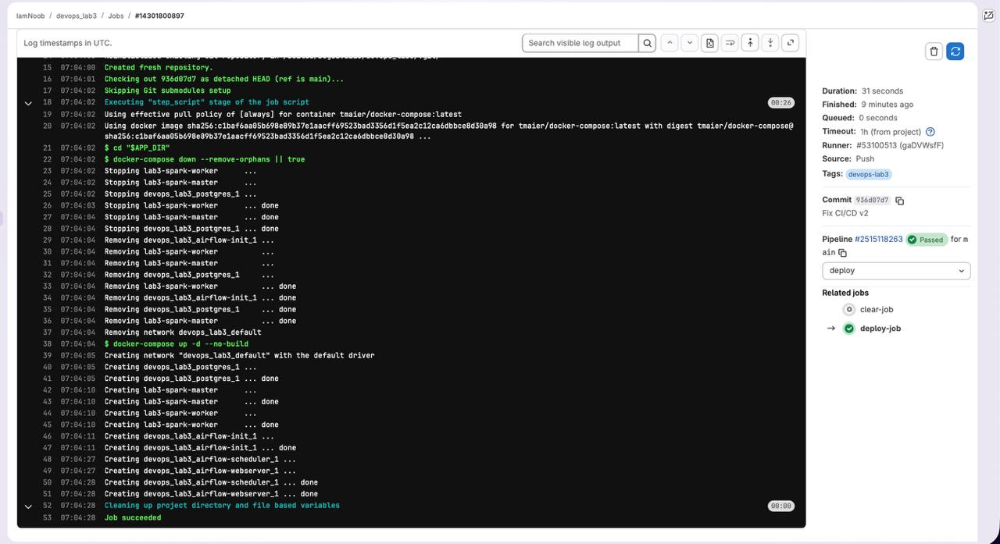
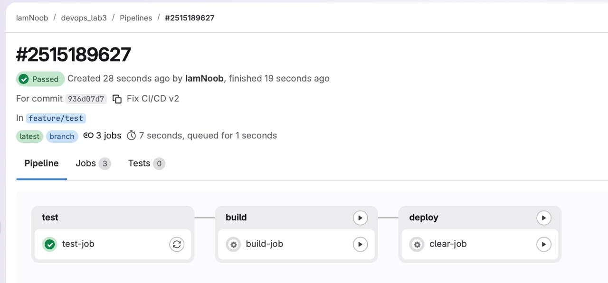

# Lab №3

## Как поднять

```bash
cd lab3/gitlab-runner
docker compose up -d
docker ps
```

- Airflow UI: http://localhost:8082
- Spark UI: http://localhost:4041

Логин и пароль Airflow:

```text
airflow / airflow
```

## Пруфы что все воркает

Линк на репозиторий: https://gitlab.com/bogsava123/devops_lab3 

Картинки:













Feauture ветка ждет ручного подтверждения:
