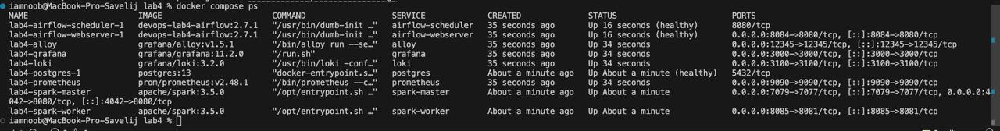
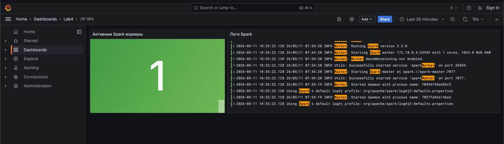
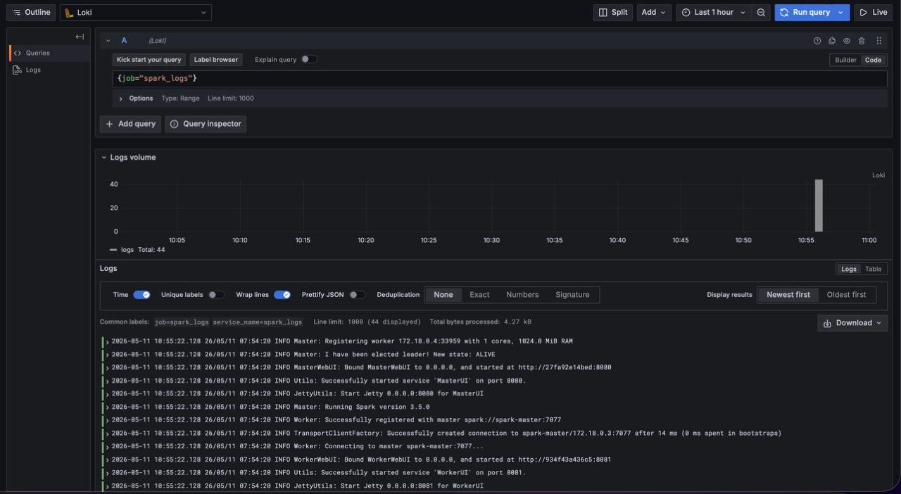
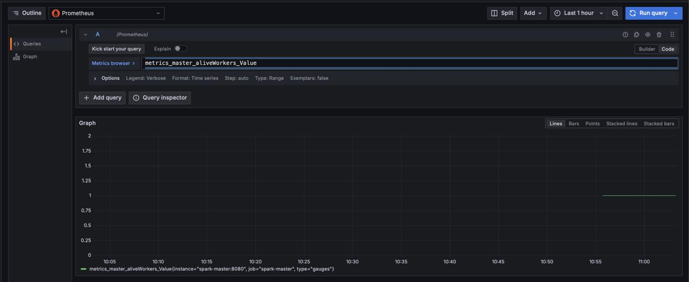
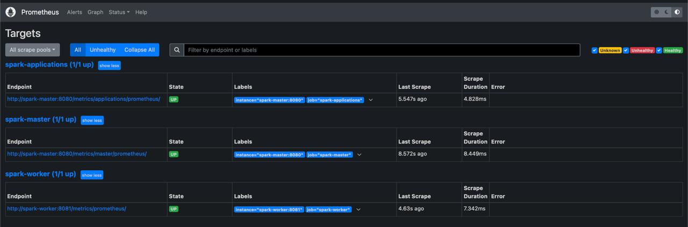

# Lab №4

## Что делает лаба?

1. запускает Airflow и Spark
2. собирает логи Airflow и Spark через Alloy
3. отправляет логи в Loki
4. собирает метрики Spark через Prometheus
5. показывает логи и метрики в Grafana

## Как запустить

```bash
docker compose build
docker compose up airflow-init
docker compose up -d
docker compose ps
```

## Ссылки

- Airflow UI: http://localhost:8084
- Spark master UI: http://localhost:4042
- Spark worker UI: http://localhost:8085
- Prometheus: http://localhost:9090
- Grafana: http://localhost:3000

Логин и пароль Airflow:

```text
airflow / airflow
```

У Grafana нет кредитов для входа

## Пруфы что все воркает









